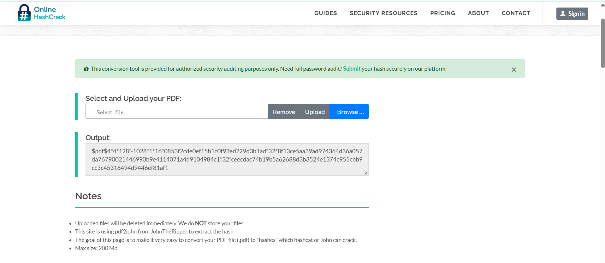
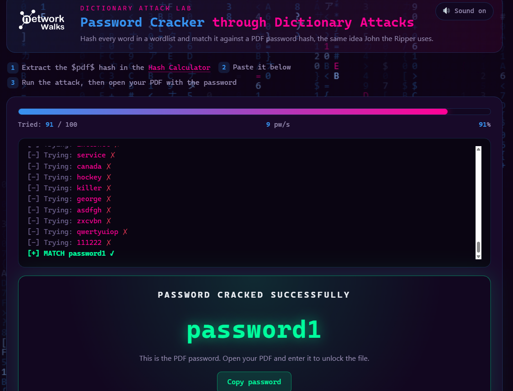
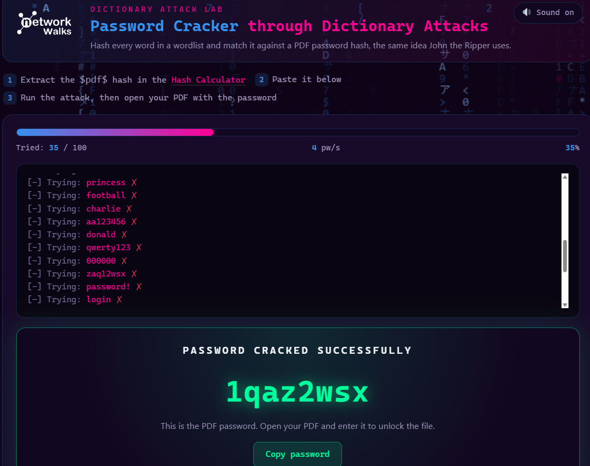
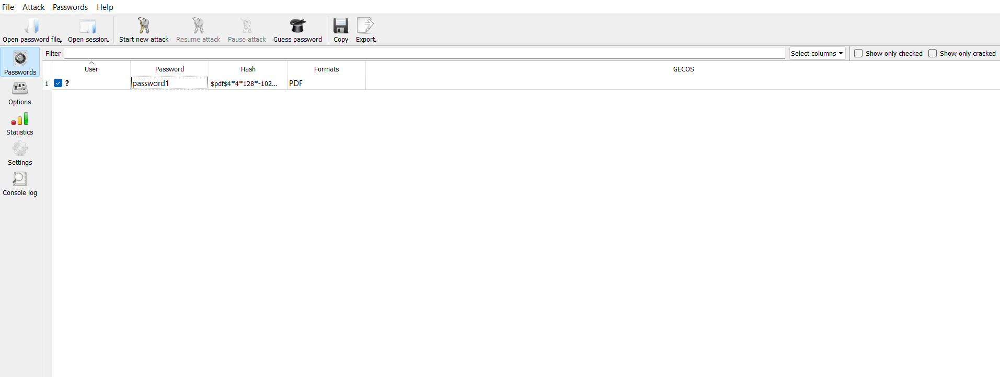
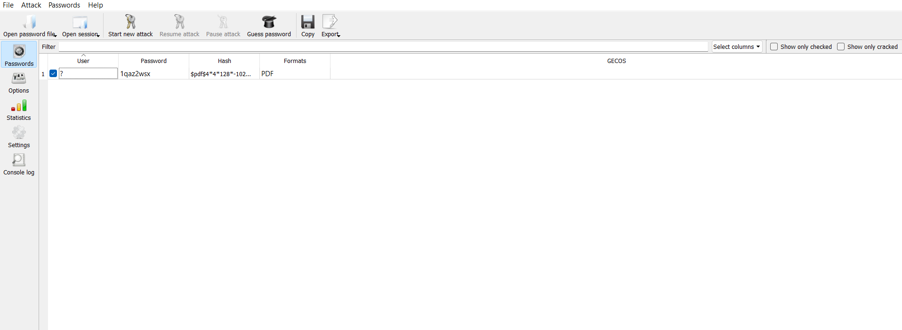
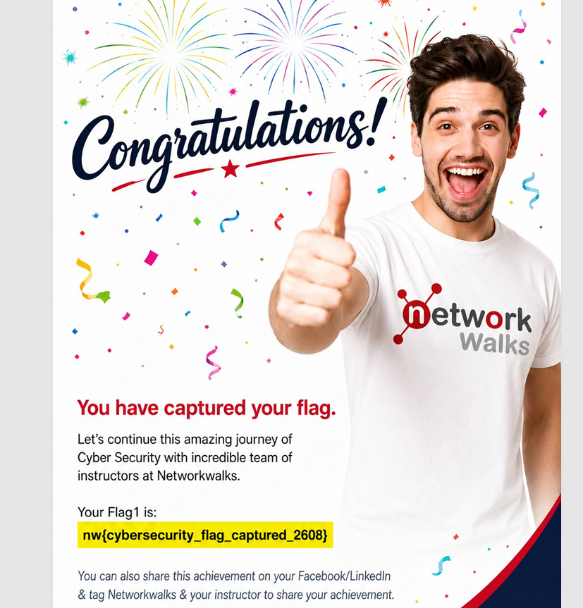
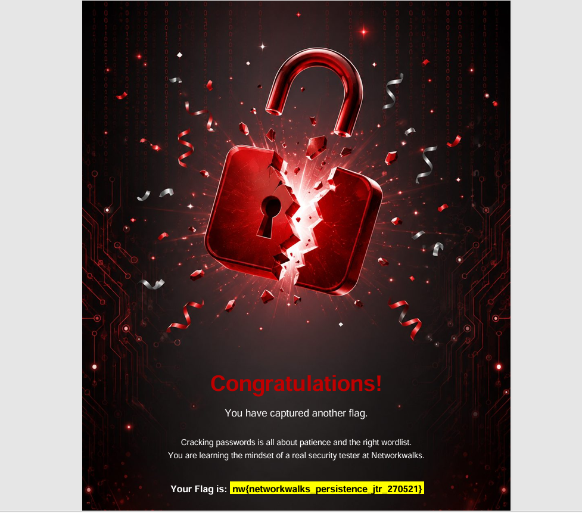

# 🔐 Password Cracking with John the Ripper & Networkwalks

<p align="center">


</p>

<p align="center">
  <b>A hands-on cybersecurity laboratory demonstrating password auditing, dictionary attacks, PDF hash extraction, and password recovery using John the Ripper and Johnny GUI.</b>
</p>

---

## 📌 Project Overview

This project was completed as part of a **Networkwalks Cybersecurity Training Program**.

The objective of this practical exercise was to understand how password-protected PDF documents can be assessed in an authorized security-testing environment.

The project demonstrates the complete workflow:

```text
Password-Protected PDF
        ↓
Hash Extraction
        ↓
Crackable PDF Hash
        ↓
Dictionary Attack
        ↓
Password Recovery
        ↓
Validation using John the Ripper
        ↓
Johnny GUI Verification
        ↓
Lab Completion Flags
```

The exercise combines a **Networkwalks interactive dictionary-attack laboratory** with the **John the Ripper / Johnny GUI** password-auditing tool.

> ⚠️ **Ethical & Legal Notice**
>
> This project was performed strictly in a controlled cybersecurity training environment using authorized laboratory files. Password-cracking techniques must only be used against files, accounts, hashes, or systems that you own or have explicit permission to test.

---

# 🎯 Objectives

The main objectives of this project were to:

* Understand how password-protected PDF files store encryption information.
* Extract a crackable hash representation from a PDF.
* Understand the concept of a **dictionary attack**.
* Observe how candidate passwords are tested against a target hash.
* Recover weak passwords in a controlled laboratory environment.
* Use **John the Ripper** for password auditing.
* Use **Johnny GUI** as a graphical interface for John the Ripper.
* Compare simulated attack results with an actual password-auditing tool.
* Understand why weak and predictable passwords are vulnerable.
* Capture and document laboratory completion flags.

---

# 🛠️ Technologies & Tools

| Tool                                      | Purpose                                                                                    |
| ----------------------------------------- | ------------------------------------------------------------------------------------------ |
| 🔐 **John the Ripper**                    | Password auditing and recovery                                                             |
| 🖥️ **Johnny GUI**                        | Graphical interface for John the Ripper                                                    |
| 📄 **PDF Hash Extraction / pdf2john**     | Converts protected PDF encryption information into a format suitable for password auditing |
| 🌐 **Networkwalks Dictionary Attack Lab** | Interactive simulation of dictionary-based password attacks                                |
| 📝 **GitHub**                             | Project documentation and version control                                                  |
| 💻 **Linux Security Environment**         | Laboratory environment for security testing                                                |

---

# 📂 Project Structure

```text
Password-Cracking-with-John-The-Ripper-and-Networkwalks-Tools/
│
├── README.md
│
└── images/
    │
    ├── 01-pdf2john-hash-extraction.png
    ├── 02-dictionary-attack-lab-password1.png
    ├── 03-dictionary-attack-lab-1qaz2wsx.png
    ├── 04-johnny-gui-password1-cracked.png
    ├── 05-johnny-gui-1qaz2wsx-cracked.png
    ├── 06-flag-networkwalks-persistence.png
    └── 07-flag-cybersecurity-captured.png
```

---

# 🔎 PM-1 — PDF Hash Extraction

## Step 1: Identify the Protected PDF

The first stage of the laboratory involved working with password-protected PDF documents supplied for the authorized training exercise.

The objective was to understand that the PDF itself does not simply expose the password. Instead, information associated with the document's encryption can be transformed into a format that password-auditing tools can process.

---

## Step 2: Extract the Hash

A PDF hash-extraction process was used to obtain a crackable representation of the document's password protection.

### Screenshot



### What this demonstrates

The extracted value provides John the Ripper with the information required to perform an offline password-auditing exercise.

This is an important cybersecurity concept because password auditing generally operates against **stored password representations**, rather than directly interacting with the original authentication mechanism.

---

# ⚔️ PM-1 — Dictionary Attack Simulation

After obtaining the required hash representation, the project moved to the Networkwalks dictionary-attack laboratory.

A **dictionary attack** works by taking candidate passwords from a wordlist and testing them against the target.

Conceptually:

```text
Wordlist
   │
   ├── Candidate 1
   ├── Candidate 2
   ├── Candidate 3
   ├── Candidate 4
   │       ↓
   │   Hash / Verify
   │       ↓
   │   Target Hash
   │       ↓
   └── Match Found
```

---

## 🔑 Target 1 — Dictionary Attack

The first laboratory password was successfully recovered during the dictionary attack exercise.

### Result

```text
Recovered Password: password1
```

### Screenshot



The laboratory demonstrated that a common and predictable password can appear very early in a relatively small wordlist.

---

## 🔑 Target 2 — Dictionary Attack

A second password-protected target was tested using the same methodology.

### Result

```text
Recovered Password: 1qaz2wsx
```

### Screenshot



This example demonstrates another important password-security weakness: **predictable keyboard patterns** can also make passwords easier to guess.

---

# 🖥️ PM-2 — John the Ripper & Johnny GUI

After completing the simulated Networkwalks exercise, the recovered results were validated using **John the Ripper** through its graphical front-end, **Johnny**.

This provided practical experience with a real password-auditing utility rather than only relying on a browser-based simulation.

---

## 🔐 Password 1 — Johnny GUI

The first target was loaded into Johnny and successfully processed.

### Result

```text
Password: password1
```

### Screenshot



The result matched the password recovered during the Networkwalks laboratory.

---

## 🔐 Password 2 — Johnny GUI

The second target was also tested through Johnny.

### Result

```text
Password: 1qaz2wsx
```

### Screenshot



The result again matched the previous laboratory exercise.

This provided confirmation that the simulated attack and the actual password-auditing workflow produced consistent results.

---

# 🔄 Complete Project Workflow

The complete laboratory process can be summarized as:

```text
┌──────────────────────────────┐
│ Password-Protected PDF       │
└──────────────┬───────────────┘
               │
               ▼
┌──────────────────────────────┐
│ PDF Hash Extraction          │
│ pdf2john / Hash Extraction   │
└──────────────┬───────────────┘
               │
               ▼
┌──────────────────────────────┐
│ Crackable Hash Representation│
└──────────────┬───────────────┘
               │
               ▼
┌──────────────────────────────┐
│ Networkwalks Dictionary Lab  │
└──────────────┬───────────────┘
               │
               ▼
┌──────────────────────────────┐
│ Password Recovery            │
└──────────────┬───────────────┘
               │
               ▼
┌──────────────────────────────┐
│ John the Ripper / Johnny     │
│ Independent Validation       │
└──────────────┬───────────────┘
               │
               ▼
┌──────────────────────────────┐
│ Successful Lab Completion    │
└──────────────────────────────┘
```

---

# 🚩 Laboratory Completion Flags

Successful completion of the training activities produced the following laboratory flags.

## 🛡️ Cybersecurity Flag



```text
nw{cybersecurity_flag_captured_2608}
```

---

## 🔥 Networkwalks Persistence Flag



```text
nw{networkwalks_persistence_jtr_270521}
```

These flags served as evidence of successful completion of the corresponding laboratory stages.

---

# 📊 Results Summary

| Target             | Attack Method            | Result      | Validation   |
| ------------------ | ------------------------ | ----------- | ------------ |
| PDF Target 1       | Dictionary Attack        | `password1` | ✅ Johnny GUI |
| PDF Target 2       | Dictionary Attack        | `1qaz2wsx`  | ✅ Johnny GUI |
| Lab Stage 1        | Networkwalks Simulation  | Completed   | ✅            |
| Lab Stage 2        | John the Ripper / Johnny | Completed   | ✅            |
| Cybersecurity Flag | Networkwalks Lab         | Captured    | ✅            |
| Persistence Flag   | Networkwalks Lab         | Captured    | ✅            |

---

# 🧠 Key Cybersecurity Concepts Learned

## 1. Dictionary Attacks

A dictionary attack tests password candidates from a predefined collection of commonly used or likely passwords.

Weak passwords can therefore be recovered quickly when they appear in the attacker's candidate list.

---

## 2. Password Predictability

Passwords such as common words, simple numbers, and keyboard patterns can have significantly lower effective resistance to guessing attacks than long, random passwords.

Examples from this laboratory included:

```text
password1
1qaz2wsx
```

The purpose of the exercise was to demonstrate this weakness in a controlled environment.

---

## 3. Offline Password Auditing

Once a suitable password representation is available, password auditing can be performed without repeatedly communicating with the original application.

This makes strong password construction and secure password-storage mechanisms particularly important.

---

## 4. John the Ripper

**John the Ripper (JtR)** is a widely used password-security auditing tool.

It can be used by security professionals to evaluate password strength in authorized environments.

---

## 5. Johnny GUI

**Johnny** provides a graphical interface for John the Ripper.

It makes it easier to observe password-auditing operations without relying exclusively on command-line interaction.

---

# 🛡️ Security Recommendations

The laboratory also highlights several practical password-security recommendations:

### ✅ Use long passwords

Prefer long passphrases or randomly generated passwords.

### ✅ Avoid predictable patterns

Avoid:

```text
password
password1
123456
qwerty
keyboard patterns
```

### ✅ Use unique passwords

Do not reuse the same password across multiple services.

### ✅ Use a password manager

Password managers can generate and securely store strong, unique credentials.

### ✅ Use MFA

Multi-factor authentication provides an additional security layer beyond passwords.

### ✅ Use secure password storage

Applications should use modern password-hashing mechanisms designed to resist offline guessing attacks, with appropriate salting and work factors.

---

# 📸 Project Screenshots

## PDF Hash Extraction


## Networkwalks Dictionary Attack — Target 1


## Networkwalks Dictionary Attack — Target 2


## Johnny GUI — Target 1


## Johnny GUI — Target 2


## Networkwalks Persistence Flag


## Cybersecurity Flag


# 🎓 Learning Outcomes

After completing this project, the following concepts were practically demonstrated:

* 🔐 Password security
* 🔎 Hash extraction
* 📚 Dictionary attacks
* 🧪 Password auditing
* 🖥️ John the Ripper
* 🎛️ Johnny GUI
* 📄 PDF encryption concepts
* 🛡️ Password-strength assessment
* 🔑 Weak-password identification
* 📊 Security-lab documentation
* 🚩 Capture-the-flag style laboratory validation

---

# ⚠️ Responsible Use

This repository is intended **strictly for cybersecurity education, training, and authorized security testing**.

Do not use password-cracking techniques against:

* Accounts you do not own
* Files you do not have permission to test
* Corporate systems without authorization
* Third-party services
* Networks or systems belonging to others

Always obtain explicit authorization before performing security testing.

---

# 🙏 Acknowledgements

Special thanks to **Networkwalks** for providing the cybersecurity training laboratory and practical exercises.

Tools and concepts demonstrated in this project include:

* **John the Ripper**
* **Johnny GUI**
* **PDF hash extraction**
* **Dictionary attack methodology**
* **Networkwalks Cybersecurity Training Labs**

---

# 👨‍💻 Author

**M K Kodali**

Cybersecurity Enthusiast | Security Lab Projects | Ethical Hacking

---

<p align="center">

### 🔐 Learn • Test • Secure

**Cybersecurity is not about breaking systems — it's about understanding how to protect them.**

</p>
